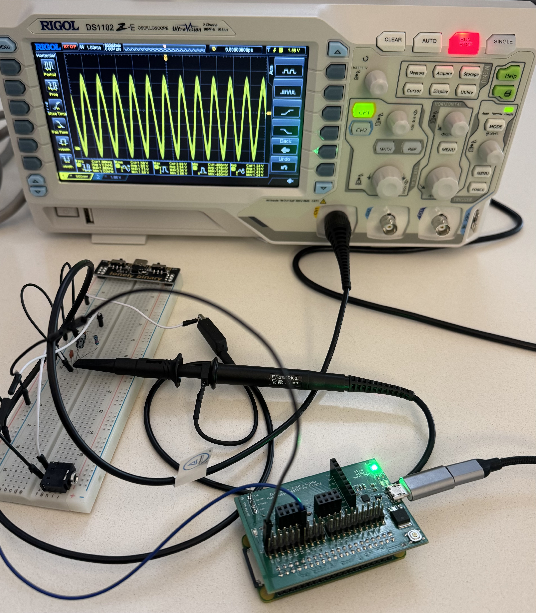
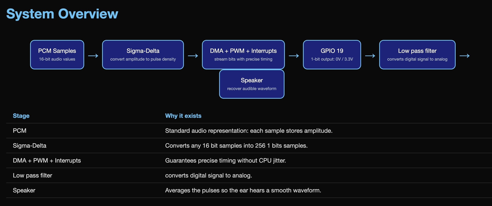

# PiDMASound

Bare-metal audio playback on Raspberry Pi using **only GPIO, DMA, PWM, and interrupts**.

No operating system.
No audio codec.
No DAC chip.

Just hardware.


To play audio we need an analog signal. But, **bare metal**, the gpio can only output digital levels: 0 and 3.3V . **How can we produce analog sound with bare-metal ?**

<p align="center">
  
</p>


# Architecture

The engine converts PCM samples into a high-frequency PDM bitstream using a sigma-delta modulator.
That bitstream is then streamed to the Raspberry Pi's PWM peripheral using DMA.

<p align="center">
  
</p>

**PiDMASound** converts PCM audio into a **1-bit pulse density modulated (PDM) stream** and outputs it through a single GPIO pin. A simple RC low-pass filter reconstructs the analog waveform, allowing the Raspberry Pi to play real audio with minimal external hardware.

# Demo

PiDMASound can generate tones, sine waves, and simple melodies such as the Mario theme or Star Wars theme using only a single GPIO pin.

GPIO18 → RC filter → speaker

```
make mario
make starwars
```
# Core Components

## Sigma-Delta Modulation

PCM audio samples are converted into a **1-bit pulse density modulated stream** using a first-order sigma-delta modulator.

Oversampling ratio: **64×**

```
44.1 kHz × 64 = 2.8224 MHz PDM stream
```

The density of `1`s and `0`s represents the amplitude of the audio waveform.

When low-pass filtered, the original analog signal is reconstructed.

---

## PWM Serializer Output

The Raspberry Pi PWM peripheral is used in **serializer mode**.

Instead of generating duty cycles, the PWM hardware shifts out **individual bits from its FIFO** directly onto the GPIO pin.

Each bit becomes a high or low pulse, producing the PDM stream on **GPIO 18**.

---

## DMA Audio Streaming

The DMA engine continuously feeds data into the PWM FIFO using **DREQ pacing**.

Two buffers are used in a **ping-pong configuration**:

```
Buffer A → played by DMA
Buffer B → filled by CPU
```

Once DMA finishes a buffer, it switches to the other buffer automatically.

---

## Interrupt-Driven Refill

When a DMA buffer finishes, an interrupt fires at roughly:

```
~2756 interrupts per second
```

This is a memory optimization - it prevents from having to allocate one massive buffer, instead we allocate two small buffers that are alternatively pushed to the gpio, freed, refiled.

The interrupt handler:

1. Takes the next PCM samples
2. Runs sigma-delta modulation
3. Generates the next PDM block
4. Refills the completed DMA buffer

This allows **continuous audio playback with minimal CPU usage**.

---

# Hardware Setup

Required hardware:

* Raspberry Pi (BCM2835 compatible)
* speaker or headphones

---

# Repository Structure

```
asm/
  start.S
  interrupts-asm.S

src/
  audio-dma.c
  audio-dma.h
  sigma-delta.c

songs/
  mario.c
  starwars.c
```

### asm/

Bare-metal code for interrupts and bootloader.

### src/

Core audio engine including DMA configuration, PWM setup, and sigma-delta modulation.

### songs/

Example melodies implemented using the audio engine.

--- 
Realized as part of Stanford CS140E final Project.